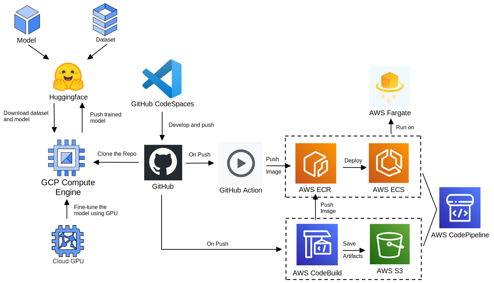

# Yelp Review Rating Prediction

## Introduction

This project utilizes Google Cloud Platform, GitHub, Amazon Web Services, and Huggingface technology to go through the development, testing, and deployment process of a yelp review rating prediction service. The flow chart of this project is shown below. 

The model and dataset are pulled from Huggingface, fine-tuned on the GPU from GCP, and pushed back to Huggingface. The code and web app are developed in GitHub CodeSpaces. Finally, the docker image of the service is deployed on AWS through two CI/CD practices. 

## Dataset

The dataset used to train the model is the [yelp_review_full](https://huggingface.co/datasets/yelp_review_full) dataset from Huggingface. The dataset contains cased reviews and the corresponding rating as labels.

## Model

The model used to fine-tune is [roberta-base](https://huggingface.co/roberta-base), the last layer of the model is replaced by random initialized values to fit the specific task. The model is trained for 5 epochs and achieves an accuracy of 0.67 on 5-class classification. The trained model is stored in [yelp_review_rating_reberta_base](https://huggingface.co/Shunian/yelp_review_rating_reberta_base). 

## CI/CD Process

Two paths of continuous integration and continuous deployment using container technology are implemented. 

The first way is through GitHub Action. The GitHub Action goes through code formatting, dependencies installation and checking, code testing, docker image building, and then pushing the docker image to AWS ECR. Next, the image is pulled to AWS ECS through the AWS CodePipeline service, once the docker image is updated. Finally, the docker image will be run on AWS Fargate.

The second path totally relies on AWS CodePipeline. First, AWS CodePipeline will pull the source code to AWS once the code is pushed to GitHub. Then, the AWS CodeBuild will build a docker image through the instruction specified by `buildspec.yml`. Then the docker image will be pushed toward AWS ECR and the rest of the steps will be the same as above.

